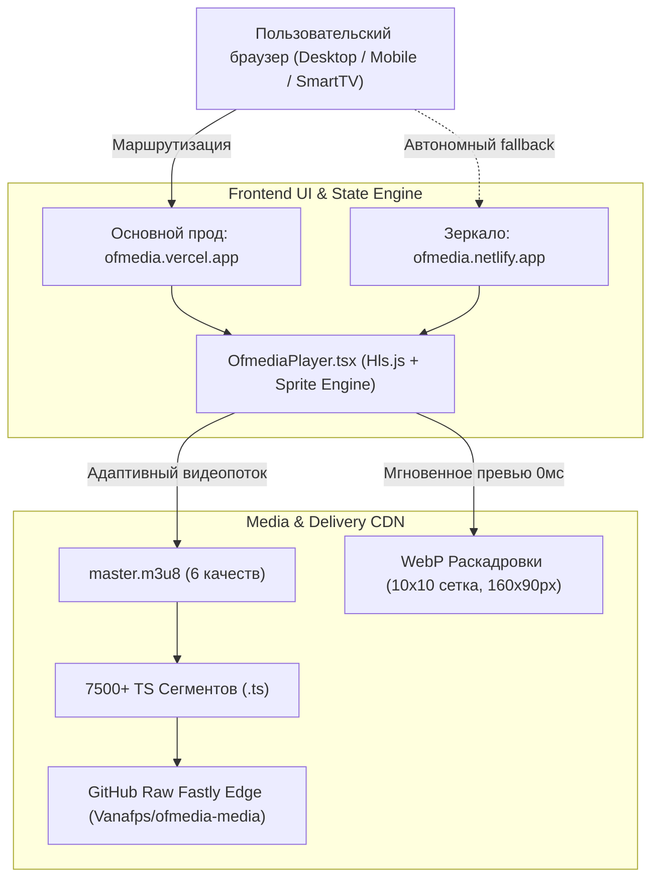

# КОДИФИКАЦИЯ ОНЛАЙН-КИНОТЕАТРА OFMEDIA
**Официальный технический паспорт, номенклатура контента и стандарт видеоинфраструктуры**  
*Редакция 1.0 • Сентябрь 2026 г.*

---

## 1. Преамбула и архитектурная доктрина

Настоящий документ устанавливает единый технологический, номенклатурный и эксплуатационный регламент платформы онлайн-кинотеатра **OFMEDIA**.

Платформа спроектирована по стандарту **Zero-Rutube / Zero-Ads / Dual-CDN**:
1. **Полная независимость от сторонних видеохостингов:** Отсутствие iframe-плееров Rutube, YouTube или VK, исключающее стороннюю рекламу, баннеры, трекеры и принудительную буферизацию.
2. **Адаптивный HLS-стриминг собственного базиса:** Многобитрейтное вещание (от 144p до 1080p Full HD) с нарезкой на транспортные потоки MPEG-TS (4-секундные сегменты).
3. **Аппаратный таймлайн-скраббинг 60 FPS:** Отказ от видеодекодера при предпросмотре кадров над полосой перемотки в пользу легковесных WebP Storyboard Sprite Sheets.
4. **Отказоустойчивое двойное зеркалирование:** Синхронная работа двух независимых глобальных CDN-инстансов (Vercel Production + Netlify Mirror) с бесшовным переключением.

---

## 2. Кодификатор медиа-контента (Content Registry)

Для каждого релиза платформы закреплён уникальный системный артикул формата:  
$$\mathbf{OFM\text{-}F\langle\text{NN}\rangle\text{-}\langle\text{SLUG}\rangle}$$

### Официальный реестр релизов

| Артикул | Название фильма | Год | Хронометраж | Возраст | Жанры | HLS Master Playlist | Storyboard |
| :--- | :--- | :---: | :---: | :---: | :--- | :--- | :--- |
| `OFM-F01-CLIP` | **Клип — Школа 2070** | 2026 | 03:15 | 6+ | Музыкальное, Комедия, Клип | `clip/master.m3u8` | `clip.webp` (175 КБ) |
| `OFM-F02-PARK` | **Поездка в парк** | 2024 | 27:14 | 12+ | Комедия, Приключения, Влог | `park/master.m3u8` | `park.webp` (298 КБ) |
| `OFM-F03-NALIM` | **Налим — Постановка** | 2024 | 08:42 | 6+ | Комедия, Постановка, Шоу | `nalim/master.m3u8` | `nalim.webp` (174 КБ) |
| `OFM-F04-VDNH` | **Поездка на ВДНХ** | 2024 | 08:15 | 6+ | Приключения, Шоу, Влог | `vdnh/master.m3u8` | `vdnh.webp` (170 КБ) |
| `OFM-F05-NG` | **Новогодний корпоратив** | 2024 | 16:30 | 6+ | Комедия, Шоу, Музыкальное | `ng/master.m3u8` | `ng.webp` (158 КБ) |
| `OFM-F06-HOR` | **Каждый класс — Хор** | 2026 | 22:45 | 6+ | Музыкальное, Шоу, Комедия | `hor/master.m3u8` | `hor.webp` (218 КБ) |

---

## 3. Спецификация HLS видеопотоков (Video Encoding Standards)

Все видеоматериалы кодируются аппаратно с использованием графического процессора Nvidia GeForce GTX 1060 (NVENC 6-го поколения) с фиксированным шагом опорных кадров (GOP).

### Таблица ступеней качества (Profiles & Bitrates)

| Идентификатор | Разрешение | Битрейт видео | Битрейт аудио | Кодек | Профиль | GOP / Keyframe |
| :--- | :---: | :---: | :---: | :---: | :---: | :---: |
| `1080p` | **1920×1080** | 3500 kbps | 192 kbps | H.264 (`h264_nvenc`) | High @ L4.1 | 120 кадров (4 сек) |
| `720p` | **1280×720** | 2000 kbps | 128 kbps | H.264 (`h264_nvenc`) | Main @ L3.1 | 120 кадров (4 сек) |
| `480p` | **854×480** | 1000 kbps | 96 kbps | H.264 (`h264_nvenc`) | Main @ L3.1 | 120 кадров (4 сек) |
| `360p` | **640×360** | 600 kbps | 64 kbps | H.264 (`h264_nvenc`) | Baseline @ L3.0 | 120 кадров (4 сек) |
| `240p` | **426×240** | 350 kbps | 48 kbps | H.264 (`h264_nvenc`) | Baseline @ L3.0 | 120 кадров (4 сек) |
| `144p` | **256×144** | 180 kbps | 32 kbps | H.264 (`h264_nvenc`) | Baseline @ L3.0 | 120 кадров (4 сек) |

### Параметры нарезки и заголовки CDN

- **Длительность чанка:** 4.0 секунды (`-hls_time 4`).
- **Схема именования сегментов:** `segment_%04d.ts`.
- **MIME-типы CDN:**
  - Плейлисты (`.m3u8`): `text/plain` или `application/vnd.apple.mpegurl`.
  - Транспортные потоки (`.ts`): `video/mp2t`.
- **Политика CORS:** `Access-Control-Allow-Origin: *` (гарантирует чтение через XHR/Fetch в Web Worker Hls.js без проксирования).

### Стандарт буферизации (Adaptive Smart Buffer)

Для достижения максимальной отказоустойчивости при скачках связи без риска переполнения памяти (`QuotaExceededError`) зафиксирован стандарт:
- **Глубина буфера вперед (`maxBufferLength`):** 60 секунд (15 сегментов).
- **Максимальный предел буфера (`maxMaxBufferLength`):** 90 секунд (до 1.5 минут автономного воспроизведения без сети).
- **Очистка просмотренного хвоста (`backBufferLength`):** 30 секунд (автоматическое освобождение RAM).
- **Потолок памяти буфера (`maxBufferSize`):** 60 МБ (гарантия стабильности для Safari и мобильных браузеров).
- **Микросдвиг стыков (`nudgeOffset`):** 0.1 сек при задержке на границах сегментов.

---

## 4. Спецификация раскадровок (Storyboard & Scrubber Spec)

Для обеспечения нулевой задержки (0 мс) при ведении курсора по шкале времени применяется индустриальный стандарт **Storyboard Sprite Sheet**.

### Стандарт формирования полотна

1. **Формат:** Google WebP (`image/webp`), коэффициент сжатия `q:v 70`.
2. **Топология сетки:** Ровно $10$ колонок $\times$ $10$ строк $= 100$ кадров на фильм.
3. **Размер одного тайла:** $160 \times 90$ пикселей (соотношение 16:9).
4. **Суммарный размер холста:** $1600 \times 900$ пикселей.
5. **Весовой норматив:** не более $300$ КБ на один фильм (для мгновенной загрузки даже при слабом 3G/LTE).

### Математический аппарат выборки кадра в `OfmediaPlayer.tsx`

При наведении курсора на временную позицию $t$ из общей длительности $T$:

$$\text{progress} = \max\left(0, \, \min\left(0.999, \, \frac{t}{T}\right)\right)$$

$$\text{frameIndex} = \lfloor \text{progress} \times 100 \rfloor$$

$$\text{col} = \text{frameIndex} \bmod 10, \quad \text{row} = \lfloor \text{frameIndex} / 10 \rfloor$$

$$\text{bgPosX} = \frac{\text{col}}{9} \times 100\%, \quad \text{bgPosY} = \frac{\text{row}}{9} \times 100\%$$

$$\text{CSS: } \texttt{background-size: 1000\% 1000\%; background-position: \$\{bgPosX\}\% \$\{bgPosY\}\%;}$$

---

## 5. Топология зеркал и инфраструктура

| Узел | Назначение | Провайдер | Домен / URL | Тип деплоя |
| :--- | :--- | :--- | :--- | :--- |
| **Основной продакшен** | Первичный шлюз | Vercel Edge Global | `https://ofmedia.vercel.app` | Vercel CLI (zero-token auto-refresh) |
| **Автономное зеркало** | Дублирующий узел | Netlify Edge | `https://ofmedia.netlify.app` | Netlify API Direct Zip Deploy |
| **Видео-CDN** | Хранилище HLS и сегментов | Fastly / GitHub | `raw.githubusercontent.com/Vanafps/ofmedia-media/main` | Git LFS-free Chunked Storage |
| **Исходный код** | Контроль версий веб-клиента | GitHub | `https://github.com/Vanafps/ofmedia-web` | Git Main Branch |

---

## 6. Дизайн-система OFMEDIA Cinema

1. **Цветовая палитра:**
   - Базовый фон: `Cinematic Obsidian` (`#0c0c12`)
   - Поверхности карточек: `Dark Slate Glass` (`#161622` с `backdrop-blur-2xl`)
   - Фирменный акцент: `OFMEDIA Blaze Orange` (`#ff5c00` $\rightarrow$ `#ff7a29`)
   - Текст: `Zinc 100` (`#f4f4f5`) для заголовков, `Zinc 400` (`#a1a1aa`) для описаний.
2. **Типографика:** `Inter`, `system-ui`, `sans-serif` с плотным трекингом в числовых индикаторах времени (`tracking-wider`).
3. **Микроинтерактивность:**
   - 60 FPS плавный скраббинг через `requestAnimationFrame`.
   - Центростремительные вспышки анимации при паузе/старте (`Flash Feedback`).
   - Плавное затухание контролов при бездействии мыши через 3 секунды.

---

## 7. Регламент добавления нового фильма (Ingest SOP)

При публикации любого нового фильма (например, `film7`):

1. **Подготовка исходника:**  
   Поместить мастер-файл в `ofmedia_videos_storage/film7.mp4`.
2. **Аппаратное кодирование HLS:**  
   Выполнить нарезку 6 качеств в `ofmedia_hls/film7/` с 4-секундными чанками и единым `master.m3u8`.
3. **Генерация раскадровки WebP:**  
   Запустить генерацию сетки $10 \times 10$:  
   `ffmpeg -c:v h264_cuvid -resize 160x90 -i film7.mp4 -vf fps=100/{duration},tile=10x10 -q:v 70 -vframes 1 public/storyboards/film7.webp`
4. **Загрузка медиа:**  
   Запушить каталог `film7/` в репозиторий `Vanafps/ofmedia-media`.
5. **Регистрация метаданных:**  
   Добавить объект с артикулом `OFM-F07-FILM7` в `src/data/projects.ts`.
6. **Синхронный релиз на оба зеркала:**  
   - `git push origin main` (Vercel)  
   - `python deploy_netlify.py` (Netlify)
